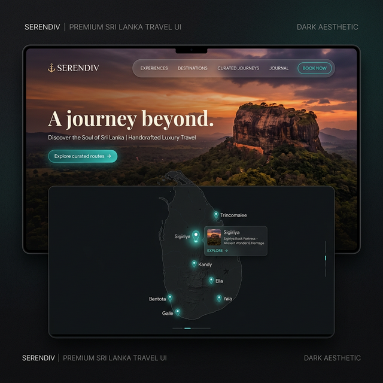

# 🌴 Serendiv.
### The Absolute Sri Lankan Journey. Beyond the Map.



**Serendiv** is a high-fidelity, immersive luxury travel platform designed to showcase the profound beauty of Sri Lanka. Built with a focus on cinematic aesthetics, fluid motion, and premium user experience, it serves as a digital gateway to the island's most exclusive heritage, wildlife, and coastal retreats.

---

## ✨ Features

- **🎭 Aura Discovery Engine**: Dynamic vibe-shifting system that transforms the entire site's atmosphere, colors, and audio based on the chosen destination type (Heritage, Wild, or Serene).
- **🗺️ Interactive Mapbox Integration**: A custom-styled, interactive 3D map of Sri Lanka featuring cinematic location pins and video previews for key destinations.
- **✨ Fluid Micro-Animations**: Powered by GSAP and ScrollTrigger for a silky-smooth, premium scrolling experience.
- **🍃 Cinematic Visuals**: High-resolution imagery and ambient background video layers that breathe life into every section.
- **🛡️ Bespoke Inquiry System**: A sleek, minimal inquiry flow designed for high-end clientele with focus on privacy and elegance.
- **📱 Ultra-Responsive Design**: Fully optimized for a consistent luxury experience across all devices, from ultra-wide monitors to mobile screens.

---

## 🚀 Technology Stack

- **Framework**: [Quasar Framework](https://quasar.dev/) (Vue 3)
- **Styling**: [Tailwind CSS](https://tailwindcss.com/)
- **Animation**: [GSAP](https://greensock.com/gsap/) & [ScrollTrigger](https://greensock.com/scrolltrigger/)
- **Smooth Scroll**: [Lenis](https://lenis.darkroom.engineering/)
- **Interactive Map**: [Mapbox GL JS](https://www.mapbox.com/mapbox-gljs)
- **3D Particles**: [Three.js](https://threejs.org/)

---

## 🛠️ Installation & Setup

1. **Clone the repository**:
   ```bash
   git clone https://github.com/Witcher21/Serendiv.git
   cd Serendiv
   ```

2. **Install dependencies**:
   ```bash
   npm install
   # or
   yarn install
   ```

3. **Configure Environment Variables**:
   Create a `.env` file in the root directory and add your Mapbox token:
   ```env
   VITE_MAPBOX_ACCESS_TOKEN=your_mapbox_token_here
   ```

4. **Run in development mode**:
   ```bash
   quasar dev
   ```

5. **Build for production**:
   ```bash
   quasar build
   ```

---

## 🚢 Deployment

This project is optimized for deployment on **Vercel**. 

- The configuration is handled via `vercel.json` for SPA routing.
- Ensure the `VITE_MAPBOX_ACCESS_TOKEN` is set in the Vercel project environment variables.

---

## 🎨 Design Philosophy

Serendiv aims to evoke the feeling of "Serendipity" — the occurrence of events by chance in a happy or beneficial way. The design uses deep dark gradients, sleek typography, and subtle micro-movements to create a sense of mystery and luxury worthy of the "Pearl of the Indian Ocean."

---

*Est. 2026 | Immersive Luxury Travel Design*
